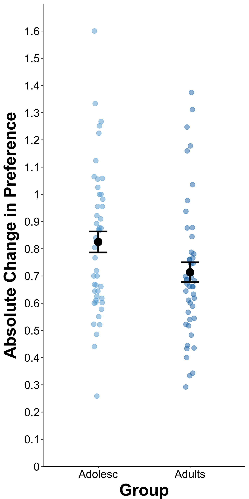
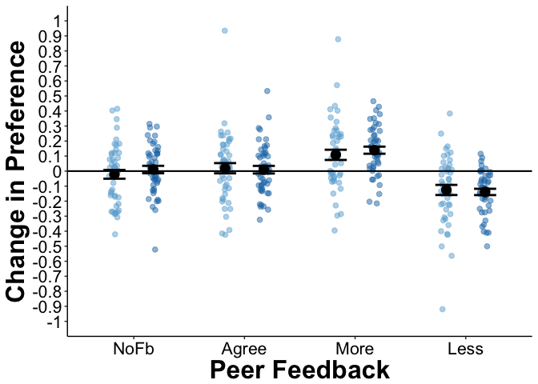

BehavPaperCode
================
Rebecca Martin
7/11/2017

-   [Set up](#set-up)
    -   [Settings](#settings)
    -   [Packages](#packages)
    -   [Read in data](#read-in-data)
    -   [Grand mean center and get adjusted means for plotting](#grand-mean-center-and-get-adjusted-means-for-plotting)
    -   [Make theme for plots](#make-theme-for-plots)
-   [Baseline differences between young adolescents and adults](#baseline-differences-between-young-adolescents-and-adults)
    -   [Distribution of ratings density plot](#distribution-of-ratings-density-plot)
    -   [Calculate average ratings by group](#calculate-average-ratings-by-group)
    -   [Plot average initial ratings](#plot-average-initial-ratings)
    -   [Statistical analysis of baseline differences](#statistical-analysis-of-baseline-differences)
    -   [Calculate absolute change across all conditions (our volitility measure)](#calculate-absolute-change-across-all-conditions-our-volitility-measure)
    -   [Plot absolute change in preference rating graph](#plot-absolute-change-in-preference-rating-graph)
    -   [Statistical analysis of volitility](#statistical-analysis-of-volitility)
-   [Social influence effects in young adolescents and adults](#social-influence-effects-in-young-adolescents-and-adults)
    -   [Calculate residualized change (our social influence measure)](#calculate-residualized-change-our-social-influence-measure)
    -   [Plot residualized change in preference rating (our social influence measure)](#plot-residualized-change-in-preference-rating-our-social-influence-measure)
    -   [Statistical analysis of change in preference as function of social influence](#statistical-analysis-of-change-in-preference-as-function-of-social-influence)
-   [Individual Differences Analysis](#individual-differences-analysis)
    -   [Prepare conformity data](#prepare-conformity-data)
    -   [Get Individual Differences Correlations](#get-individual-differences-correlations)
    -   [Statistical Analysis of Individual differences data](#statistical-analysis-of-individual-differences-data)
    -   [Make individual difference plots](#make-individual-difference-plots)
        -   [General Health Measures](#general-health-measures)
        -   [Gender](#gender)
        -   [Social Individual Differences](#social-individual-differences)
        -   [Food and Eating Health Habit Plots](#food-and-eating-health-habit-plots)

Set up
======

Settings
--------

``` r
knitr::opts_chunk$set(cache=TRUE)
```

``` r
root <- rprojroot::find_rstudio_root_file()
dataDir <- file.path(root, 'data')
codeDir <- file.path(root, 'code')
figureDir <- file.path(root, 'figures')
```

Packages
--------

``` r
library(reshape2)
library(plyr)
library(tidyverse)
library(lme4)
library(lmerTest)
library(effsize)
source(file.path(codeDir, "CreateFunctions.R"))
source(file.path(codeDir, "correlate_multiple_specific_variables.R"))
```

Read in data
------------

``` r
raw <- read.table(file.path(dataDir, 'raw.txt'), header=TRUE, sep='\t')
phase2merged <- read.table(file.path(dataDir, 'new_anon.txt'), header=TRUE, sep='\t')
teens <- read.table(file.path(dataDir, 'teensonly.txt'), header=TRUE, sep='\t')
adults <- read.table(file.path(dataDir, 'adultsonly.txt'), header=TRUE, sep='\t')
averagedData <- read.table(file.path(dataDir, 'all_avgd_subset.txt'), header=TRUE, sep='\t')

phase2merged$group <- factor(phase2merged$group, labels = c("Adults", "Adolesc")) # changes levels for graphing
```

Grand mean center and get adjusted means for plotting
-----------------------------------------------------

``` r
# all
p1_gmcenter <-  scale(phase2merged$phase1rating, scale=F)
phase2merged$p1rating_gmcenter <- p1_gmcenter
phase2merged$p1rating_gmcenter <- as.numeric(phase2merged$p1rating_gmcenter)

# teens
p1_gmcenter <-  scale(teens$phase1rating, scale=F)
teens$p1rating_gmcenter <- p1_gmcenter
teens$p1rating_gmcenter <- as.numeric(teens$p1rating_gmcenter)

# adults
p1_gmcenter <-  scale(adults$phase1rating, scale=F)
adults$p1rating_gmcenter <- p1_gmcenter
adults$p1rating_gmcenter <- as.numeric(adults$p1rating_gmcenter)

# residuals
adjmeans_all <-  lmer(phasediffrating ~ p1rating_gmcenter+(1+p1rating_gmcenter|subjid), data=phase2merged)
phase2merged$resid <- resid(adjmeans_all)

## Center by age group
phase2merged <- within(phase2merged, {phase1ratingGM = ave(phase1rating, group , FUN = mean)})
phase2merged$phase1ratingGC <- phase2merged$phase1rating - phase2merged$phase1ratingGM

## Make adjusted change scores (residuals controlling for time 1 ratings) for graphing
adjmeans_phasediffrating <- lmer(phasediffrating ~ phase1ratingGC + (1 + phase1ratingGC|subjid), data=phase2merged)
phase2merged$adjphasediffratingGV <- resid(adjmeans_phasediffrating)
```

Make theme for plots
--------------------

``` r
beckys.theme = theme(panel.background = element_rect(fill='transparent'),
                        axis.line = element_line(color='black'),
                        panel.grid.minor = element_line(color='transparent'),
                        axis.title.x = element_text(size=20, vjust=-.25),
                        axis.title.y = element_text(size=20, vjust=1),
                        axis.text.x = element_text(size=16, colour="black"),
                        axis.text.y = element_text(size=16, colour="black"),
                        legend.text=element_text(size=14))

beckys.theme.conference = theme(panel.background = element_rect(fill='transparent'),
                        axis.line = element_line(color='black'),
                        panel.grid.minor = element_line(color='transparent'),
                        axis.title.x = element_text(size=24, vjust=-.25, face = "bold"),
                        axis.title.y = element_text(size=24, vjust=1, face = "bold"),
                        axis.text.x = element_text(size=16, colour="black"),
                        axis.text.y = element_text(size=16, colour="black"),
                        legend.text=element_text(size=16),
                        strip.text.y = element_text(size = 16),
                        strip.text.x = element_text(size = 16))

beckys.theme.facet = theme(panel.background = element_rect(fill='transparent', colour="black"), # adds lines betw. panels
                        axis.line = element_line(color='black'),
                        panel.grid.minor = element_line(color='transparent'),
                        axis.title.x = element_text(size=20, vjust=-.25),
                        axis.title.y = element_text(size=20, vjust=1),
                        axis.text.x = element_text(size=16, colour="black"),
                        axis.text.y = element_text(size=14, colour="black"),
                        legend.text=element_text(size=14),
                        strip.text = element_text(size = 12),
                        strip.text.x = element_text(size = 16))
```

Baseline differences between young adolescents and adults
=========================================================

Distribution of ratings density plot
------------------------------------

``` r
distbytrial <-  ggplot(phase2merged, aes(x=phase1rating,fill=group)) + 
  geom_density(adjust=2, alpha=.7) + # add , colour=NA if want to take out black outlines
  beckys.theme +
  scale_x_continuous(limits = c(1, 7), breaks=seq(1, 7,1)) +
  scale_fill_manual(values=c("#1f78b4","#a6cee3")) + 
  scale_linetype_manual(values=c("#1f78b4","#a6cee3")) + 
  guides(fill = guide_legend(reverse = TRUE, override.aes = list(colour = NULL))) +
  xlab("Initial Ratings") +
  ylab("Density") +
  #theme(legend.key = element_rect(colour = "black"))
  beckys.theme.conference +
  theme(axis.line.x=element_line(color = 'black'),legend.position = "none", axis.line.y=element_line(color = 'black'))

distbytrial
```


Calculate average ratings by group
----------------------------------

``` r
overallaverages <- plyr::ddply(phase2merged, c("subjid","group"), summarise, phase1rating=mean(phase1rating))
overallaverages$group <-  factor(overallaverages$group, levels = rev(levels(factor(overallaverages$group))))
overallavg_summary <-  summarySE(overallaverages, measurevar="phase1rating", groupvars=c("group"))

overallavg_summary
```

<script data-pagedtable-source type="application/json">
{"columns":[{"label":["group"],"name":[1],"type":["fctr"],"align":["left"]},{"label":["N"],"name":[2],"type":["dbl"],"align":["right"]},{"label":["phase1rating"],"name":[3],"type":["dbl"],"align":["right"]},{"label":["sd"],"name":[4],"type":["dbl"],"align":["right"]},{"label":["se"],"name":[5],"type":["dbl"],"align":["right"]},{"label":["ci"],"name":[6],"type":["dbl"],"align":["right"]}],"data":[{"1":"Adolesc","2":"47","3":"4.279711","4":"1.0198883","5":"0.1487660","6":"0.2994504"},{"1":"Adults","2":"47","3":"4.878768","4":"0.8492587","5":"0.1238771","6":"0.2493517"}],"options":{"columns":{"min":{},"max":[10]},"rows":{"min":[10],"max":[10]},"pages":{}}}
  </script>

Plot average initial ratings
----------------------------

``` r
overallavg_point <-  ggplot(overallaverages, aes(x=group, y=phase1rating, color=group, group=group)) 
overallavg_point + geom_point(position=position_jitterdodge(dodge.width=.7, jitter.width = .2), size=3, alpha=.7) +
scale_color_manual(values=c("#6baed6","#1f78b4")) + 
  geom_errorbar(data=overallavg_summary, aes(ymin=phase1rating-se, ymax=phase1rating+se), width=.3, position=position_dodge(.7), size=1.5, alpha=1, color="black") +
  geom_point(data=overallavg_summary, position=position_dodge(.7), stat="identity", size=5, mapping=aes(x=group, y=phase1rating, color=group), alpha=1, color="black") + 
  xlab("Age Group") + 
  ylab("Average Initial Rating") + 
  scale_y_continuous(limits = c(1, 7), breaks=seq(1, 7, 1)) +
  beckys.theme.conference +
  #geom_hline(aes(yintercept=0), size=.75) + 
  theme(axis.line.x=element_line(color = 'black'),legend.position = "none", axis.line.y=element_line(color = 'black'))
```


``` r
#ggsave("figures/meanRatingbyGroup.pdf", width=5, height=7, dpi=300)
```

Statistical analysis of baseline differences
--------------------------------------------

``` r
# Does age group predict baseline ratings? 
baseline <-  lmer(p1rating_gmcenter ~ group + (1|subjid), data=phase2merged) 
summary(baseline)
```

    ## Linear mixed model fit by REML t-tests use Satterthwaite approximations
    ##   to degrees of freedom [lmerMod]
    ## Formula: p1rating_gmcenter ~ group + (1 | subjid)
    ##    Data: phase2merged
    ## 
    ## REML criterion at convergence: 50304.1
    ## 
    ## Scaled residuals: 
    ##     Min      1Q  Median      3Q     Max 
    ## -3.1258 -0.7238  0.1381  0.7422  2.6844 
    ## 
    ## Random effects:
    ##  Groups   Name        Variance Std.Dev.
    ##  subjid   (Intercept) 0.8547   0.9245  
    ##  Residual             3.3498   1.8302  
    ## Number of obs: 12349, groups:  subjid, 94
    ## 
    ## Fixed effects:
    ##              Estimate Std. Error      df t value Pr(>|t|)   
    ## (Intercept)    0.3097     0.1371 92.3500   2.259  0.02623 * 
    ## groupAdolesc  -0.5991     0.1938 92.2400  -3.091  0.00264 **
    ## ---
    ## Signif. codes:  0 '***' 0.001 '**' 0.01 '*' 0.05 '.' 0.1 ' ' 1
    ## 
    ## Correlation of Fixed Effects:
    ##             (Intr)
    ## groupAdolsc -0.707

``` r
confint(baseline, level=.9, method="Wald")
```

    ##                      5 %       95 %
    ## .sig01                NA         NA
    ## .sigma                NA         NA
    ## (Intercept)   0.08422206  0.5352522
    ## groupAdolesc -0.91790056 -0.2802368

Get percentages for distribution differences

``` r
## Are means betw. groups different? 
groupmeans <- t.test(phase1rating ~ group, data=phase2merged, na.rm=TRUE)
groupmeans
```

    ## 
    ##  Welch Two Sample t-test
    ## 
    ## data:  phase1rating by group
    ## t = 16.065, df = 12211, p-value < 2.2e-16
    ## alternative hypothesis: true difference in means is not equal to 0
    ## 95 percent confidence interval:
    ##  0.5202999 0.6649175
    ## sample estimates:
    ##  mean in group Adults mean in group Adolesc 
    ##              4.869615              4.277007

``` r
groupmeans <-  ddply(phase2merged, .(subjid, group), summarise, initrating=mean(phase1rating))
groupsummary <-  summarySE(groupmeans, measurevar="initrating", groupvars="group")

## Do k-s test to show how distribution is different
ks.test(phase2merged$phase1rating[phase2merged$group=="Adolesc"], phase2merged$phase1rating[phase2merged$group=="Adults"], na.rm=TRUE)
```

    ## 
    ##  Two-sample Kolmogorov-Smirnov test
    ## 
    ## data:  phase2merged$phase1rating[phase2merged$group == "Adolesc"] and phase2merged$phase1rating[phase2merged$group == "Adults"]
    ## D = 0.13491, p-value < 2.2e-16
    ## alternative hypothesis: two-sided

``` r
## calculate proportions of neg, extreme and pos ratings
proportions <- phase2merged %>% group_by(group, subjid) %>% 
  summarise(Bottom=sum(phase1rating < 4)/n(),
            # | is or, & is and
            Extreme=sum(phase1rating <= 1 | phase1rating >= 7)/n(),
            Edges=sum(phase1rating <= 2 | phase1rating >= 6)/n(),
            Top=sum(phase1rating >= 5)/n())

var.test(Bottom ~ group, data=proportions)
```

    ## 
    ##  F test to compare two variances
    ## 
    ## data:  Bottom by group
    ## F = 0.62062, num df = 46, denom df = 46, p-value = 0.1093
    ## alternative hypothesis: true ratio of variances is not equal to 1
    ## 95 percent confidence interval:
    ##  0.345687 1.114213
    ## sample estimates:
    ## ratio of variances 
    ##          0.6206198

``` r
var.test(Extreme ~ group, data=proportions)
```

    ## 
    ##  F test to compare two variances
    ## 
    ## data:  Extreme by group
    ## F = 0.61557, num df = 46, denom df = 46, p-value = 0.1034
    ## alternative hypothesis: true ratio of variances is not equal to 1
    ## 95 percent confidence interval:
    ##  0.3428755 1.1051514
    ## sample estimates:
    ## ratio of variances 
    ##          0.6155724

``` r
var.test(Edges ~ group, data=proportions)
```

    ## 
    ##  F test to compare two variances
    ## 
    ## data:  Edges by group
    ## F = 0.72451, num df = 46, denom df = 46, p-value = 0.2781
    ## alternative hypothesis: true ratio of variances is not equal to 1
    ## 95 percent confidence interval:
    ##  0.4035522 1.3007234
    ## sample estimates:
    ## ratio of variances 
    ##          0.7245065

``` r
var.test(Top ~ group, data=proportions)
```

    ## 
    ##  F test to compare two variances
    ## 
    ## data:  Top by group
    ## F = 0.83633, num df = 46, denom df = 46, p-value = 0.5469
    ## alternative hypothesis: true ratio of variances is not equal to 1
    ## 95 percent confidence interval:
    ##  0.465840 1.501489
    ## sample estimates:
    ## ratio of variances 
    ##          0.8363333

``` r
propBottom <- t.test(Bottom ~ group,var.equal=T, data=proportions, na.rm=TRUE) # easier way to do t-test
cohen.d(Bottom ~ group, data=proportions)
```

    ## 
    ## Cohen's d
    ## 
    ## d estimate: -0.7285888 (medium)
    ## 95 percent confidence interval:
    ##       inf       sup 
    ## -1.151662 -0.305516

``` r
propExtreme <- t.test(Extreme ~ group, var.equal=T, data=proportions, na.rm=TRUE)
propEdges <- t.test(Edges ~ group, var.equal=T, data=proportions, na.rm=TRUE)
propTop <- t.test(Top ~ group, var.equal=T, data=proportions, na.rm=TRUE)
cohen.d(Top ~ group, data=proportions)
```

    ## 
    ## Cohen's d
    ## 
    ## d estimate: 0.593691 (medium)
    ## 95 percent confidence interval:
    ##       inf       sup 
    ## 0.1750646 1.0123174

``` r
## regression of neg values
negval <- lm(Bottom ~ group, data=proportions)
summary(negval)
```

    ## 
    ## Call:
    ## lm(formula = Bottom ~ group, data = proportions)
    ## 
    ## Residuals:
    ##      Min       1Q   Median       3Q      Max 
    ## -0.36249 -0.12863 -0.01422  0.09388  0.46571 
    ## 
    ## Coefficients:
    ##              Estimate Std. Error t value Pr(>|t|)    
    ## (Intercept)   0.24968    0.02719   9.184 1.19e-14 ***
    ## groupAdolesc  0.13580    0.03845   3.532 0.000647 ***
    ## ---
    ## Signif. codes:  0 '***' 0.001 '**' 0.01 '*' 0.05 '.' 0.1 ' ' 1
    ## 
    ## Residual standard error: 0.1864 on 92 degrees of freedom
    ## Multiple R-squared:  0.1194, Adjusted R-squared:  0.1098 
    ## F-statistic: 12.47 on 1 and 92 DF,  p-value: 0.000647

Calculate absolute change across all conditions (our volitility measure)
------------------------------------------------------------------------

``` r
mageffect <- plyr::ddply(phase2merged, c("subjid", "group"), summarise, absratingchange=mean(absphasediffrating))
mageffect$group = factor(mageffect$group, levels = rev(levels(factor(mageffect$group))))
mag_summary = summarySE(mageffect, measurevar="absratingchange", groupvars=c("group"))

mag_summary
```

<script data-pagedtable-source type="application/json">
{"columns":[{"label":["group"],"name":[1],"type":["fctr"],"align":["left"]},{"label":["N"],"name":[2],"type":["dbl"],"align":["right"]},{"label":["absratingchange"],"name":[3],"type":["dbl"],"align":["right"]},{"label":["sd"],"name":[4],"type":["dbl"],"align":["right"]},{"label":["se"],"name":[5],"type":["dbl"],"align":["right"]},{"label":["ci"],"name":[6],"type":["dbl"],"align":["right"]}],"data":[{"1":"Adolesc","2":"47","3":"0.8249051","4":"0.2642166","5":"0.03853995","6":"0.07757690"},{"1":"Adults","2":"47","3":"0.7135615","4":"0.2498940","5":"0.03645079","6":"0.07337164"}],"options":{"columns":{"min":{},"max":[10]},"rows":{"min":[10],"max":[10]},"pages":{}}}
  </script>

Plot absolute change in preference rating graph
-----------------------------------------------

``` r
abs_point <-  ggplot(mageffect, aes(x=group, y=absratingchange, color=group, group=group)) 

abs_point + geom_point(position=position_jitterdodge(dodge.width=.7, jitter.width = .2), size=3, alpha=.5) + 
  scale_color_manual(values=c("#63ABD6","#1f78b4")) + 
  geom_errorbar(data=mag_summary, aes(ymin=absratingchange-se, ymax=absratingchange+se), width=.2, position=position_dodge(.7), size=1.2, alpha=1, color="black") +
  geom_point(data=mag_summary, position=position_dodge(.7), stat="identity", size=5, mapping=aes(x=group, y=absratingchange, color=group), alpha=1, color="black") + 
  xlab("Group") + 
  ylab("Absolute Change in Preference") + 
  scale_y_continuous(limits = c(0, 1.7), breaks=seq(0, 1.8,.1), labels=abbreviate, expand = c(0,0)) +
  beckys.theme.conference +
  #geom_hline(aes(yintercept=0), size=.75) + 
  theme(axis.line.x=element_line(color = 'black'),legend.position = "none", axis.line.y=element_line(color = 'black'), axis.title.y=element_text(margin=margin(0, 10, 0, 0)))
```



``` r
ggsave(file.path(figureDir,"absoluteChangeDiss.pdf"), width=5, height=7, dpi=300)
```

``` r
mageffect <- plyr::ddply(phase2merged, c("subjid", "Phase1PCond2", "group"), summarise, absratingchange=mean(absphasediffrating))
mageffect$Phase1PCond2 = factor(mageffect$Phase1PCond2, labels = c("Less", "Agree", "More", "NoFb"))
mageffect$group = factor(mageffect$group, levels = rev(levels(factor(mageffect$group))))
mag_summary = summarySE(mageffect, measurevar="absratingchange", groupvars=c("Phase1PCond2", "group"))

mag_summary
```

<script data-pagedtable-source type="application/json">
{"columns":[{"label":["Phase1PCond2"],"name":[1],"type":["fctr"],"align":["left"]},{"label":["group"],"name":[2],"type":["fctr"],"align":["left"]},{"label":["N"],"name":[3],"type":["dbl"],"align":["right"]},{"label":["absratingchange"],"name":[4],"type":["dbl"],"align":["right"]},{"label":["sd"],"name":[5],"type":["dbl"],"align":["right"]},{"label":["se"],"name":[6],"type":["dbl"],"align":["right"]},{"label":["ci"],"name":[7],"type":["dbl"],"align":["right"]}],"data":[{"1":"Less","2":"Adolesc","3":"47","4":"0.8383612","5":"0.3452309","6":"0.05035710","7":"0.10136359"},{"1":"Less","2":"Adults","3":"47","4":"0.7482723","5":"0.3337511","6":"0.04868261","7":"0.09799301"},{"1":"Agree","2":"Adolesc","3":"47","4":"0.8146797","5":"0.3114680","6":"0.04543228","7":"0.09145045"},{"1":"Agree","2":"Adults","3":"47","4":"0.6662252","5":"0.2887945","6":"0.04212501","7":"0.08479325"},{"1":"More","2":"Adolesc","3":"47","4":"1.0269701","5":"0.4636196","6":"0.06762587","7":"0.13612381"},{"1":"More","2":"Adults","3":"47","4":"0.8486522","5":"0.3071167","6":"0.04479758","7":"0.09017285"},{"1":"NoFb","2":"Adolesc","3":"47","4":"0.7355304","5":"0.3086035","6":"0.04501445","7":"0.09060939"},{"1":"NoFb","2":"Adults","3":"47","4":"0.6475580","5":"0.2817294","6":"0.04109446","7":"0.08271886"}],"options":{"columns":{"min":{},"max":[10]},"rows":{"min":[10],"max":[10]},"pages":{}}}
  </script>

``` r
abs_point2 <-  ggplot(mageffect, aes(x=Phase1PCond2, y=absratingchange, color=group, group=group)) 

abs_point2 + geom_point(position=position_jitterdodge(dodge.width=.7, jitter.width = .2), size=3, alpha=.5) + 
  #scale_color_brewer(palette="Paired") +
  scale_color_manual(values=c("#6baed6","#1f78b4")) + 
  geom_errorbar(data=mag_summary, aes(ymin=absratingchange-se, ymax=absratingchange+se), width=.4, position=position_dodge(.7), size=1, alpha=1, color="black") +
  geom_point(data=mag_summary, position=position_dodge(.7), stat="identity", size=5, mapping=aes(x=Phase1PCond2, y=absratingchange, color=group), alpha=1, color="black") + 
  xlab("Peer Feedback") + 
  ylab("Absolute Change in Preference") + 
  scale_y_continuous(limits = c(0, 2.5), breaks=seq(0, 2.5,.25)) +
  xlim("NoFb", "Agree", "More", "Less") +
  #geom_hline(aes(yintercept=0), size=.75) + 
  theme(axis.line.x=element_line(color = 'black'),legend.position = "none", axis.line.y=element_line(color = 'black'), axis.title.y=element_text(margin=margin(0, 10, 0, 0))) +
    beckys.theme.conference
```


``` r
ggsave(file.path(figureDir,"absoluteChangeAllDiss.pdf"), width=8, height=7, dpi=300)
```

Statistical analysis of volitility
----------------------------------

``` r
### Change with random slopes

### Interaction
groupchangeinteraction <-  lmer(absphasediffrating ~ Phase1PeerDiff_combcontrol*group+(1+Phase1PeerDiff_combcontrol|subjid), data=phase2merged)
summary(groupchangeinteraction)
```

    ## Linear mixed model fit by REML t-tests use Satterthwaite approximations
    ##   to degrees of freedom [lmerMod]
    ## Formula: absphasediffrating ~ Phase1PeerDiff_combcontrol * group + (1 +  
    ##     Phase1PeerDiff_combcontrol | subjid)
    ##    Data: phase2merged
    ## 
    ## REML criterion at convergence: 34678.5
    ## 
    ## Scaled residuals: 
    ##     Min      1Q  Median      3Q     Max 
    ## -2.0876 -0.6943 -0.2652  0.3829  5.6125 
    ## 
    ## Random effects:
    ##  Groups   Name                       Variance Std.Dev. Corr 
    ##  subjid   (Intercept)                0.05504  0.2346        
    ##           Phase1PeerDiff_combcontrol 0.01463  0.1210   -0.06
    ##  Residual                            0.94525  0.9722        
    ## Number of obs: 12349, groups:  subjid, 94
    ## 
    ## Fixed effects:
    ##                                         Estimate Std. Error       df
    ## (Intercept)                              0.72445    0.03668 92.16000
    ## Phase1PeerDiff_combcontrol               0.01737    0.02133 88.98000
    ## groupAdolesc                             0.11229    0.05183 91.86000
    ## Phase1PeerDiff_combcontrol:groupAdolesc  0.02889    0.03007 87.64000
    ##                                         t value Pr(>|t|)    
    ## (Intercept)                              19.750   <2e-16 ***
    ## Phase1PeerDiff_combcontrol                0.814   0.4176    
    ## groupAdolesc                              2.166   0.0329 *  
    ## Phase1PeerDiff_combcontrol:groupAdolesc   0.961   0.3392    
    ## ---
    ## Signif. codes:  0 '***' 0.001 '**' 0.01 '*' 0.05 '.' 0.1 ' ' 1
    ## 
    ## Correlation of Fixed Effects:
    ##             (Intr) Ph1PD_ grpAdl
    ## Phs1PrDff_c -0.033              
    ## groupAdolsc -0.708  0.023       
    ## Phs1PrDf_:A  0.023 -0.709 -0.042

``` r
confint(groupchangeinteraction, level=0.9, method="Wald")
```

    ##                                                 5 %       95 %
    ## .sig01                                           NA         NA
    ## .sig02                                           NA         NA
    ## .sig03                                           NA         NA
    ## .sigma                                           NA         NA
    ## (Intercept)                              0.66411793 0.78478811
    ## Phase1PeerDiff_combcontrol              -0.01771377 0.05246081
    ## groupAdolesc                             0.02703622 0.19754671
    ## Phase1PeerDiff_combcontrol:groupAdolesc -0.02056246 0.07834914

``` r
### Interaction no peer feedback
groupchangeinteraction2 <-  lmer(absphasediffrating ~ group+(1|subjid), data=phase2merged)
summary(groupchangeinteraction2)
```

    ## Linear mixed model fit by REML t-tests use Satterthwaite approximations
    ##   to degrees of freedom [lmerMod]
    ## Formula: absphasediffrating ~ group + (1 | subjid)
    ##    Data: phase2merged
    ## 
    ## REML criterion at convergence: 34781.5
    ## 
    ## Scaled residuals: 
    ##     Min      1Q  Median      3Q     Max 
    ## -1.5086 -0.6978 -0.3137  0.3802  5.6204 
    ## 
    ## Random effects:
    ##  Groups   Name        Variance Std.Dev.
    ##  subjid   (Intercept) 0.05833  0.2415  
    ##  Residual             0.96241  0.9810  
    ## Number of obs: 12349, groups:  subjid, 94
    ## 
    ## Fixed effects:
    ##              Estimate Std. Error       df t value Pr(>|t|)    
    ## (Intercept)   0.71402    0.03762 92.71000  18.981   <2e-16 ***
    ## groupAdolesc  0.11138    0.05314 92.31000   2.096   0.0388 *  
    ## ---
    ## Signif. codes:  0 '***' 0.001 '**' 0.01 '*' 0.05 '.' 0.1 ' ' 1
    ## 
    ## Correlation of Fixed Effects:
    ##             (Intr)
    ## groupAdolsc -0.708

Social influence effects in young adolescents and adults
========================================================

Calculate residualized change (our social influence measure)
------------------------------------------------------------

``` r
ageeffect <-  ddply(phase2merged, .(subjid, group, Phase1PCond2), summarise, diffscore=mean(resid))
ageeffect$Phase1PCond2 <-  factor(ageeffect$Phase1PCond2, labels = c("Less", "Agree", "More", "NoFb"))
ageeffect$group <-  factor(ageeffect$group, levels = rev(levels(factor(ageeffect$group))))
age_summary <-  summarySE(ageeffect, measurevar="diffscore", groupvars=c("Phase1PCond2", "group"))

age_summary
```

<script data-pagedtable-source type="application/json">
{"columns":[{"label":["Phase1PCond2"],"name":[1],"type":["fctr"],"align":["left"]},{"label":["group"],"name":[2],"type":["fctr"],"align":["left"]},{"label":["N"],"name":[3],"type":["dbl"],"align":["right"]},{"label":["diffscore"],"name":[4],"type":["dbl"],"align":["right"]},{"label":["sd"],"name":[5],"type":["dbl"],"align":["right"]},{"label":["se"],"name":[6],"type":["dbl"],"align":["right"]},{"label":["ci"],"name":[7],"type":["dbl"],"align":["right"]}],"data":[{"1":"Less","2":"Adolesc","3":"47","4":"-0.125482856","5":"0.2308439","6":"0.03367205","7":"0.06777832"},{"1":"Less","2":"Adults","3":"47","4":"-0.138701786","5":"0.1439497","6":"0.02099722","7":"0.04226522"},{"1":"Agree","2":"Adolesc","3":"47","4":"0.019257894","5":"0.2328037","6":"0.03395791","7":"0.06835373"},{"1":"Agree","2":"Adults","3":"47","4":"0.009484965","5":"0.1737263","6":"0.02534059","7":"0.05100796"},{"1":"More","2":"Adolesc","3":"47","4":"0.108241066","5":"0.2330304","6":"0.03399098","7":"0.06842030"},{"1":"More","2":"Adults","3":"47","4":"0.139268825","5":"0.1619243","6":"0.02361909","7":"0.04754276"},{"1":"NoFb","2":"Adolesc","3":"47","4":"-0.021463816","5":"0.1998453","6":"0.02915043","7":"0.05867677"},{"1":"NoFb","2":"Adults","3":"47","4":"0.010579534","5":"0.1682919","6":"0.02454790","7":"0.04941235"}],"options":{"columns":{"min":{},"max":[10]},"rows":{"min":[10],"max":[10]},"pages":{}}}
  </script>

Plot residualized change in preference rating (our social influence measure)
----------------------------------------------------------------------------

``` r
age_point <-  ggplot(ageeffect, aes(x=Phase1PCond2, y=diffscore, color=group, group=group)) 

age_point + geom_point(position=position_jitterdodge(dodge.width=.7, jitter.width = .2), size=2, alpha=.5) +
    scale_color_manual(values=c("#6baed6","#1f78b4")) + 
  geom_errorbar(data=age_summary, aes(ymin=diffscore-se, ymax=diffscore+se), width=.4, position=position_dodge(.7), size=1, alpha=1, color="black") +
  geom_point(data=age_summary, position=position_dodge(.7), stat="identity", size=4, mapping=aes(x=Phase1PCond2, y=diffscore), alpha=1, color="black") + 
  xlab("Peer Feedback") + 
  ylab("Change in Preference") + 
  scale_y_continuous(limits = c(-1, 1), breaks=seq(-1, 1,.1), labels=function(x) round(x, 2)) +
  xlim("NoFb", "Agree", "More", "Less") +
  beckys.theme.conference +
  geom_hline(aes(yintercept=0), size=.75) + 
  theme(axis.line.x=element_line(color = 'black'),legend.position = "none", axis.line.y=element_line(color = 'black'))
```



``` r
ggsave(file.path(figureDir,"BehavMainEffectsDiss.pdf"), width=7, height=5, dpi=300)
```

Statistical analysis of change in preference as function of social influence
----------------------------------------------------------------------------

``` r
### Conformity with random slopes
#### Note: pos_neg is a -1, 0, 1 variable where -1=peers lower, 0=peers agree or no feedback, 1=peers higher
```

``` r
## Main effect of Peer Cond for teens
teenresults <- lmer(phasediffrating ~ p1rating_gmcenter + pos_neg + (1 + p1rating_gmcenter + pos_neg|subjid), data=teens)
summary(teenresults)
```

    ## Linear mixed model fit by REML t-tests use Satterthwaite approximations
    ##   to degrees of freedom [lmerMod]
    ## Formula: 
    ## phasediffrating ~ p1rating_gmcenter + pos_neg + (1 + p1rating_gmcenter +  
    ##     pos_neg | subjid)
    ##    Data: teens
    ## 
    ## REML criterion at convergence: 20718.5
    ## 
    ## Scaled residuals: 
    ##     Min      1Q  Median      3Q     Max 
    ## -4.6725 -0.5184  0.0642  0.5072  4.4778 
    ## 
    ## Random effects:
    ##  Groups   Name              Variance Std.Dev. Corr       
    ##  subjid   (Intercept)       0.20670  0.4546              
    ##           p1rating_gmcenter 0.02247  0.1499   -0.66      
    ##           pos_neg           0.01850  0.1360   -0.43  0.33
    ##  Residual                   1.53664  1.2396              
    ## Number of obs: 6267, groups:  subjid, 47
    ## 
    ## Fixed effects:
    ##                   Estimate Std. Error       df t value Pr(>|t|)    
    ## (Intercept)        0.07192    0.06903 40.19000   1.042 0.303700    
    ## p1rating_gmcenter -0.22316    0.02415 42.42000  -9.242 1.02e-11 ***
    ## pos_neg            0.13526    0.03214 39.24000   4.208 0.000145 ***
    ## ---
    ## Signif. codes:  0 '***' 0.001 '**' 0.01 '*' 0.05 '.' 0.1 ' ' 1
    ## 
    ## Correlation of Fixed Effects:
    ##             (Intr) p1rtn_
    ## p1rtng_gmcn -0.588       
    ## pos_neg     -0.264  0.323

``` r
confint(teenresults, level=0.9, method='Wald')
```

    ##                           5 %       95 %
    ## .sig01                     NA         NA
    ## .sig02                     NA         NA
    ## .sig03                     NA         NA
    ## .sig04                     NA         NA
    ## .sig05                     NA         NA
    ## .sig06                     NA         NA
    ## .sigma                     NA         NA
    ## (Intercept)       -0.04162336  0.1854610
    ## p1rating_gmcenter -0.26287587 -0.1834409
    ## pos_neg            0.08238438  0.1881285

``` r
## Main effect of Peer Cond for adults
adultresults <- lmer(phasediffrating ~ p1rating_gmcenter + pos_neg + (1 + p1rating_gmcenter + pos_neg | subjid), data=adults)
summary(adultresults)
```

    ## Linear mixed model fit by REML t-tests use Satterthwaite approximations
    ##   to degrees of freedom [lmerMod]
    ## Formula: 
    ## phasediffrating ~ p1rating_gmcenter + pos_neg + (1 + p1rating_gmcenter +  
    ##     pos_neg | subjid)
    ##    Data: adults
    ## 
    ## REML criterion at convergence: 18388.4
    ## 
    ## Scaled residuals: 
    ##     Min      1Q  Median      3Q     Max 
    ## -5.0528 -0.5620  0.1086  0.4964  6.0735 
    ## 
    ## Random effects:
    ##  Groups   Name              Variance  Std.Dev. Corr       
    ##  subjid   (Intercept)       0.1482527 0.38504             
    ##           p1rating_gmcenter 0.0298107 0.17266  -0.45      
    ##           pos_neg           0.0003053 0.01747  -0.91  0.78
    ##  Residual                   1.0806948 1.03956             
    ## Number of obs: 6222, groups:  subjid, 47
    ## 
    ## Fixed effects:
    ##                     Estimate Std. Error         df t value Pr(>|t|)    
    ## (Intercept)         -0.11326    0.05829   45.20000  -1.943   0.0583 .  
    ## p1rating_gmcenter   -0.16641    0.02689   41.40000  -6.188 2.25e-07 ***
    ## pos_neg              0.15524    0.02053 1173.50000   7.561 8.04e-14 ***
    ## ---
    ## Signif. codes:  0 '***' 0.001 '**' 0.01 '*' 0.05 '.' 0.1 ' ' 1
    ## 
    ## Correlation of Fixed Effects:
    ##             (Intr) p1rtn_
    ## p1rtng_gmcn -0.415       
    ## pos_neg     -0.097  0.222

``` r
confint(adultresults, level=0.9, method='Wald')
```

    ##                          5 %        95 %
    ## .sig01                    NA          NA
    ## .sig02                    NA          NA
    ## .sig03                    NA          NA
    ## .sig04                    NA          NA
    ## .sig05                    NA          NA
    ## .sig06                    NA          NA
    ## .sigma                    NA          NA
    ## (Intercept)       -0.2091391 -0.01737905
    ## p1rating_gmcenter -0.2106437 -0.12217137
    ## pos_neg            0.1214705  0.18901166

``` r
## Interaction with teens and adults?
groupinteraction <- lmer(phasediffrating ~ p1rating_gmcenter + pos_neg*group + (1 + p1rating_gmcenter + pos_neg | subjid), data=phase2merged)
summary(groupinteraction)
```

    ## Linear mixed model fit by REML t-tests use Satterthwaite approximations
    ##   to degrees of freedom [lmerMod]
    ## Formula: phasediffrating ~ p1rating_gmcenter + pos_neg * group + (1 +  
    ##     p1rating_gmcenter + pos_neg | subjid)
    ##    Data: phase2merged
    ## 
    ## REML criterion at convergence: 38933.5
    ## 
    ## Scaled residuals: 
    ##     Min      1Q  Median      3Q     Max 
    ## -5.0609 -0.5453  0.0880  0.5122  5.4560 
    ## 
    ## Random effects:
    ##  Groups   Name              Variance Std.Dev. Corr       
    ##  subjid   (Intercept)       0.177508 0.42132             
    ##           p1rating_gmcenter 0.026166 0.16176  -0.57      
    ##           pos_neg           0.005452 0.07384  -0.43  0.32
    ##  Residual                   1.318056 1.14807             
    ## Number of obs: 12349, groups:  subjid, 94
    ## 
    ## Fixed effects:
    ##                        Estimate Std. Error         df t value Pr(>|t|)    
    ## (Intercept)           -0.018516   0.059244 100.660000  -0.313    0.755    
    ## p1rating_gmcenter     -0.194563   0.018127  84.120000 -10.733  < 2e-16 ***
    ## pos_neg                0.153587   0.024887  77.850000   6.171 2.84e-08 ***
    ## groupAdolesc          -0.009438   0.077380  91.320000  -0.122    0.903    
    ## pos_neg:groupAdolesc  -0.009242   0.034715  78.280000  -0.266    0.791    
    ## ---
    ## Signif. codes:  0 '***' 0.001 '**' 0.01 '*' 0.05 '.' 0.1 ' ' 1
    ## 
    ## Correlation of Fixed Effects:
    ##             (Intr) p1rtn_ pos_ng grpAdl
    ## p1rtng_gmcn -0.403                     
    ## pos_neg     -0.125  0.189              
    ## groupAdolsc -0.646  0.011  0.040       
    ## ps_ng:grpAd  0.034  0.004 -0.691 -0.049

``` r
confint(groupinteraction, level=0.9, method='Wald')
```

    ##                              5 %        95 %
    ## .sig01                        NA          NA
    ## .sig02                        NA          NA
    ## .sig03                        NA          NA
    ## .sig04                        NA          NA
    ## .sig05                        NA          NA
    ## .sig06                        NA          NA
    ## .sigma                        NA          NA
    ## (Intercept)          -0.11596376  0.07893096
    ## p1rating_gmcenter    -0.22437973 -0.16474696
    ## pos_neg               0.11265109  0.19452285
    ## groupAdolesc         -0.13671659  0.11784100
    ## pos_neg:groupAdolesc -0.06634314  0.04785898

Individual Differences Analysis
===============================

Prepare conformity data
-----------------------

``` r
droplevels <- c("-1","1")
disagree <- phase2merged[phase2merged$Phase1PCond2 %in% droplevels,]
disagree <- droplevels(disagree)

testconform <- plyr::ddply(disagree, .(subjid, group), summarise, phase1Av=mean(phase1rating), conformAv=mean(conform))   
averagedData$phase1 <- testconform$phase1Av
averagedData$conform2 <- testconform$conformAv

# conform fixed effects model
conformMod <- lm(conform2 ~ phase1, data=averagedData)
averagedData$conformresid <- resid(conformMod)

# Rename everything for plotting
averaged3 <- plyr::rename(averagedData, c("conformresid"="ConformityScore","STAI_CombZ"="AnxietyZ","BDI_Z"="DepressionZ", "RPI"="ResistancetoPeerInfluence","n2belong"="NeedToBelong","SCOFF"="DisorderedEating", "BMI.Group"="BMIGroup", "WASI.IQ"="IQ", "TAS"="Alexithymia","MMIS"="MediaInfluence", "BESC"="BodyImage", "CDI_BDI"="Depression", "STAI_Combined"="Anxiety", "TAN.MEAN"="PubertalStatus", "CRSQ.Anxiety.RSQ"="RejectionSensitivity", "MCSD"="SocialDesirability","SDS"="SocialDesirabilityTeens","YRBSS_Dieting"="DietingStatus","YRBSS_Health_index"="HealthyEating","YRBSS_Self_described_weight"="SelfDescribedWeight", "RSQ_Z"="RejectionSensitivity_Z", "SocDesire_Z"="SocialDesirabilityZ"))

# change levels
averaged3$group <-  factor(averaged3$group, levels = rev(levels(factor(averaged3$group))))

# Rename for lmer regression
phase2merged2 <- plyr::rename(phase2merged, c("phasediffrating"="RatingChange","p1rating_gmcenter"="InitialRating", "Sex"="Gender", "group"="AgeGroup", "pos_neg"="SocialInfluence","STAI_CombZ"="AnxietyZ","BDI_Z"="DepressionZ", "RPI"="ResistancetoPeerInfluence","n2belong"="NeedToBelong","SCOFF"="DisorderedEating", "BMI.Group"="BMIGroup", "WASI.IQ"="IQ", "TAS"="Alexithymia","MMIS"="MediaInfluence", "BESC"="BodyImage", "CDI_BDI"="Depression", "STAI_Combined"="Anxiety", "TAN.MEAN"="PubertalStatus", "CRSQ.Anxiety.RSQ"="RejectionSensitivity", "MCSD"="SocialDesirability","SDS"="SocialDesirabilityTeens","YRBSS_Dieting"="DietingStatus","YRBSS_Health_index"="HealthyEating","YRBSS_Self_described_weight"="SelfDescribedWeight", "RSQ_Z"="RejectionSensitivityZ", "SocDesire_Z"="SocialDesirabilityZ"))

# Prepare for correlations
averaged3$sex2 <- as.factor(averaged3$Sex)
averaged3$sex2 <- as.numeric(averaged3$sex2)

teenStuff <- averaged3[which(averaged3$group == "teens"),]
teenStuff <- droplevels(teenStuff)
teensAll <- subset(teenStuff, select=c("ConformityScore", "conform2", "Sex", "Age", "IQ","Edu", "Degree", "Depression", "Anxiety", "PubertalStatus", "ResistancetoPeerInfluence", "NeedToBelong", "MediaInfluence", "RejectionSensitivity", "SocialDesirabilityTeens", "HungerLevel", "Atetime", "DisorderedEating", "BodyImage", "BMI_Percentile", "SelfDescribedWeight", "DietingStatus", "HealthyEating"))

adultStuff <- averaged3[which(averaged3$group == "adults"),]
adultStuff <- droplevels(adultStuff)
adultsAll <- subset(adultStuff, select=c("ConformityScore", "conform2", 'Sex', "Age", "Depression", "Anxiety", "ResistancetoPeerInfluence", "NeedToBelong", "MediaInfluence", "RejectionSensitivity", "SocialDesirability", "HungerLevel", "Atetime", "DisorderedEating", "BMI", "SelfDescribedWeight", "DietingStatus", "HealthyEating"))

allgroups <- subset(averaged3, select=c("ConformityScore", "conform2", "Sex", "Age", "DepressionZ", "AnxietyZ", "ResistancetoPeerInfluence", "NeedToBelong", "MediaInfluence", "RejectionSensitivity_Z", "SocialDesirabilityZ", "HungerLevel", "Atetime", "DisorderedEating", "BMIGroup", "SelfDescribedWeight", "DietingStatus", "HealthyEating"))
```

Get Individual Differences Correlations
---------------------------------------

``` r
# multicor.sig(adultsAll[,1:2], adultsAll[,4:18], file.path("corrResults", "adultIndDiffscorrsig.txt"))
# multicor.sig(teensAll[,1:2], teensAll[,4:23], file.path("corrResults", "teenIndDiffscorrsig.txt"))
# 
# multicor(adultsAll[,1:2], adultsAll[,4:18], file.path("corrResults", "adultIndDiffscorr.txt"))
# multicor(teensAll[,1:2], teensAll[,4:23], file.path("corrResults", "teenIndDiffscorr.txt"))
# 
# ## All groups
# multicor.sig(allgroups[,1:2], allgroups[,4:18], file.path("corrResults", "allIndDiffscorrsig.txt"))
# multicor(allgroups[,1:2], allgroups[,4:18], file.path("corrResults", "allIndDiffscorr.txt"))
# 
# ## gender? 
# multicor.sig(averaged3[,61:62], averaged3[,6:39], file.path("corrResults", "genderIndDiffscorr.txt"))
```

Statistical Analysis of Individual differences data
---------------------------------------------------

``` r
everything <- lmer(RatingChange ~ InitialRating+SocialInfluence+AgeGroup+Gender+DepressionZ+AnxietyZ+ResistancetoPeerInfluence+NeedToBelong+RejectionSensitivityZ+SocialDesirabilityZ+HungerLevel+Atetime+BMIGroup+DisorderedEating+MediaInfluence+SelfDescribedWeight+DietingStatus+HealthyEating+(1+InitialRating+SocialInfluence|subjid), data=phase2merged2)

summary(everything)
```

    ## Linear mixed model fit by REML t-tests use Satterthwaite approximations
    ##   to degrees of freedom [lmerMod]
    ## Formula: 
    ## RatingChange ~ InitialRating + SocialInfluence + AgeGroup + Gender +  
    ##     DepressionZ + AnxietyZ + ResistancetoPeerInfluence + NeedToBelong +  
    ##     RejectionSensitivityZ + SocialDesirabilityZ + HungerLevel +  
    ##     Atetime + BMIGroup + DisorderedEating + MediaInfluence +  
    ##     SelfDescribedWeight + DietingStatus + HealthyEating + (1 +  
    ##     InitialRating + SocialInfluence | subjid)
    ##    Data: phase2merged2
    ## 
    ## REML criterion at convergence: 20948.3
    ## 
    ## Scaled residuals: 
    ##     Min      1Q  Median      3Q     Max 
    ## -4.7262 -0.5350  0.0656  0.5417  4.5481 
    ## 
    ## Random effects:
    ##  Groups   Name            Variance Std.Dev. Corr       
    ##  subjid   (Intercept)     0.13093  0.3618              
    ##           InitialRating   0.01965  0.1402   -0.40      
    ##           SocialInfluence 0.01559  0.1249   -0.48  0.31
    ##  Residual                 1.48985  1.2206              
    ## Number of obs: 6385, groups:  subjid, 51
    ## 
    ## Fixed effects:
    ##                            Estimate Std. Error        df t value Pr(>|t|)
    ## (Intercept)               -0.060083   0.828981 34.500000  -0.072    0.943
    ## InitialRating             -0.188811   0.022072 46.920000  -8.554 3.89e-11
    ## SocialInfluence            0.161724   0.030073 46.220000   5.378 2.42e-06
    ## AgeGroupAdolesc           -0.230228   0.220604 34.980000  -1.044    0.304
    ## Gender                    -0.023025   0.129597 33.730000  -0.178    0.860
    ## DepressionZ               -0.004579   0.077208 34.680000  -0.059    0.953
    ## AnxietyZ                   0.058173   0.089673 35.610000   0.649    0.521
    ## ResistancetoPeerInfluence -0.016870   0.177608 36.330000  -0.095    0.925
    ## NeedToBelong               0.082920   0.112514 33.990000   0.737    0.466
    ## RejectionSensitivityZ     -0.031495   0.084928 34.450000  -0.371    0.713
    ## SocialDesirabilityZ       -0.076971   0.117699 34.980000  -0.654    0.517
    ## HungerLevel                0.006623   0.039766 34.580000   0.167    0.869
    ## Atetime                   -0.003021   0.031318 34.830000  -0.096    0.924
    ## BMIGroup                   0.101434   0.097483 33.040000   1.041    0.306
    ## DisorderedEating           0.034311   0.057917 34.170000   0.592    0.557
    ## MediaInfluence            -0.018672   0.025258 34.420000  -0.739    0.465
    ## SelfDescribedWeight       -0.066485   0.098131 35.400000  -0.678    0.502
    ## DietingStatus             -0.027020   0.061392 33.600000  -0.440    0.663
    ## HealthyEating              0.043091   0.053528 32.860000   0.805    0.427
    ##                              
    ## (Intercept)                  
    ## InitialRating             ***
    ## SocialInfluence           ***
    ## AgeGroupAdolesc              
    ## Gender                       
    ## DepressionZ                  
    ## AnxietyZ                     
    ## ResistancetoPeerInfluence    
    ## NeedToBelong                 
    ## RejectionSensitivityZ        
    ## SocialDesirabilityZ          
    ## HungerLevel                  
    ## Atetime                      
    ## BMIGroup                     
    ## DisorderedEating             
    ## MediaInfluence               
    ## SelfDescribedWeight          
    ## DietingStatus                
    ## HealthyEating                
    ## ---
    ## Signif. codes:  0 '***' 0.001 '**' 0.01 '*' 0.05 '.' 0.1 ' ' 1

    ## 
    ## Correlation matrix not shown by default, as p = 19 > 12.
    ## Use print(x, correlation=TRUE)  or
    ##   vcov(x)     if you need it

Make individual difference plots
--------------------------------

### General Health Measures

``` r
# General Health
general <- subset(averaged3, select=c("subjid", "ConformityScore","group", "Age", "AnxietyZ", "DepressionZ")) 
general2 <- melt(averaged3, id.vars=c("subjid", "group", "ConformityScore"), measure.vars=c("Age", "AnxietyZ","DepressionZ")) 

# General scatter plot 
generalscatter <- ggplot(general2, aes(x=value, y=ConformityScore, colour=group)) 
generalscatter + 
  geom_point() + 
  scale_color_brewer(palette="Paired") +
  geom_smooth(method="lm", se=TRUE) +
  facet_wrap( ~ variable, scales="free", nrow=3) +
  ylab("Conformity Score") + 
  beckys.theme.facet +
  #scale_y_continuous(limits = c(-.2,.2), breaks=seq(-.4,.4,.05), labels=abbreviate, expand = c(0,0)) + 
  geom_hline(aes(yintercept=0), size=.25) 
```


``` r
ggsave(file.path(figureDir,"GenHealthCorrelations.pdf"), width=7, height=7, dpi=300)
```

### Gender

``` r
## Gender
gender_summary = summarySE(averaged3, measurevar="ConformityScore", groupvars=c("Sex", "group"))

genderscatter <- ggplot(averaged3, aes(x=Sex, y=ConformityScore, colour=group, fill=group)) 
genderscatter + 
  geom_point(position=position_jitterdodge(jitter.width=.4, dodge.width=.4), alpha=.7)  +
  geom_point(data=gender_summary, position=position_dodge(.4), stat="identity", size=3, mapping=aes(x=Sex, y=ConformityScore), colour="black") +
  geom_errorbar(data=gender_summary, aes(ymin=ConformityScore-se, ymax=ConformityScore+se), width=.2,position=position_dodge(.4), size=0.7, colour="black") +
  scale_color_brewer(palette="Paired") +
  ylab("Conformity Score") + 
  beckys.theme.conference +
  theme(axis.line.x=element_line(color = 'black'),legend.position = "none", axis.line.y=element_line(color = 'black')) +
  geom_hline(aes(yintercept=0), size=.25) 
```


``` r
ggsave(file.path(figureDir,"GenderCorrelations.pdf"), width=5, height=5, dpi=300)
```

### Social Individual Differences

``` r
social <- subset(averaged3, select=c("subjid","ConformityScore", "ResistancetoPeerInfluence", "NeedToBelong","SocialDesirabilityZ", "RejectionSensitivity_Z", "MediaInfluence"))  
social2 <- melt(averaged3, id.vars=c("subjid", "group", "ConformityScore"), measure.vars=c("ResistancetoPeerInfluence", "NeedToBelong","SocialDesirabilityZ", "RejectionSensitivity_Z", "MediaInfluence"))

socialscatter <- ggplot(social2, aes(x=value, y=ConformityScore, colour=group)) 
socialscatter + 
  geom_point() + 
  scale_color_brewer(palette="Paired") +
  geom_smooth(method="lm", se=TRUE) +
  facet_wrap( ~ variable, scales="free", nrow=4) +
  ylab("Conformity Score") + 
  beckys.theme.facet +
  geom_hline(aes(yintercept=0), size=.25)
```


``` r
#ggsave(file.path(figureDir,"SocialCorrelations.pdf"), width=9, height=7, dpi=300)
```

### Food and Eating Health Habit Plots

``` r
food <- subset(averaged3, select=c("subjid", "group", "ConformityScore","HungerLevel", "Atetime", "DisorderedEating", "BMIGroup","BodyImage", "SelfDescribedWeight", "DietingStatus", "HealthyEating"))
food2 <- melt(averaged3, id.vars=c("subjid", "group", "ConformityScore"), measure.vars=c("HungerLevel", "Atetime", "DisorderedEating", "BMIGroup","BodyImage", "SelfDescribedWeight", "DietingStatus", "HealthyEating"))

foodscatter <- ggplot(food2, aes(x=value, y=ConformityScore, colour=group)) 
foodscatter + 
  geom_jitter(width = 0.2) + 
  scale_color_brewer(palette="Paired") +
  geom_smooth(method="lm", se=TRUE) +
  facet_wrap( ~ variable, scales="free", nrow=4) +
  ylab("Conformity Score") + 
  beckys.theme.facet +
  geom_hline(aes(yintercept=0), size=.25) 
```


``` r
#ggsave(file.path(figureDir,"FoodCorrelations.pdf"), width=9, height=7, dpi=300)
```
